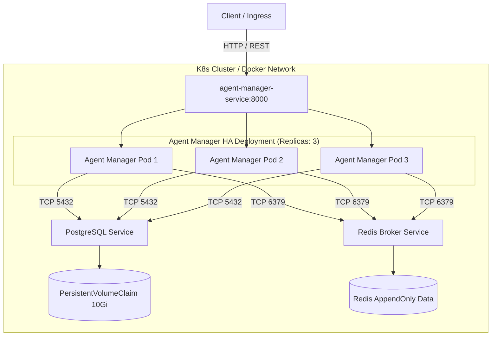

# 🏢 Enterprise Company Infrastructure (Project 01)


-326CE5)


---

## 📌 Architecture Overview

The **Enterprise Company Infrastructure** project provides a production-grade, highly available, and containerized infrastructure foundation. It orchestrates state persistence, high-speed in-memory caching/messaging, and microservice business logic using **Docker Compose** for local deployment and **Kubernetes** for enterprise cloud orchestration.



---

## 🛠️ Technology Stack & Core Components

| Component | Technology | Purpose | Configuration File |
| --- | --- | --- | --- |
| **Agent Manager** | Python 3.11 / FastAPI | Microservice orchestration & REST API | [`services/agent-manager/src/main.py`](https://www.google.com/search?q=./services/agent-manager/src/main.py) |
| **Relational Database** | PostgreSQL 16 | Persistent relational state storage | [`k8s/postgres-deployment.yaml`](https://www.google.com/search?q=./k8s/postgres-deployment.yaml) |
| **Message Broker / Cache** | Redis 7 (Alpine) | Async queue broker & in-memory cache | [`k8s/redis-deployment.yaml`](https://www.google.com/search?q=./k8s/redis-deployment.yaml) |
| **Container Engine** | Docker Compose | Multi-container local orchestration | [`docker-compose.yml`](https://www.google.com/search?q=./docker-compose.yml) |
| **Cloud Orchestration** | Kubernetes Manifests | Production HA deployment (3 replicas) | [`k8s/`](https://www.google.com/search?q=./k8s/) |

---

## 🔄 Message Broker & Asynchronous Task Pipeline

The system uses **Redis** as a lightweight, high-performance message broker and cache layer:

1. **Async Event Pipeline**: Agents submit asynchronous telemetry and task requests to Redis Pub/Sub channels (`agent:telemetry`, `agent:tasks`).
2. **Decoupled Task Execution**: The `Agent Manager` instances consume tasks asynchronously, insulating the HTTP frontend from long-running operations.
3. **Cache Layer**: Agent state and node health metrics are cached in Redis with short TTLs to eliminate database read bottlenecks.

---

## 📁 Directory Layout

```text
01-company-infrastructure/
├── 📄 docker-compose.yml                 # Local multi-container deployment
├── 📄 README.md                          # Comprehensive project documentation
├── 📁 docker/                            # Base container definitions & build configs
├── 📁 docs/                              # Architectural diagrams & specifications
├── 📁 k8s/                               # Production Kubernetes manifests
│   ├── 📄 configmap.yaml                 # Cluster configuration settings
│   ├── 📄 postgres-storage.yaml          # PersistentVolumeClaim (10Gi)
│   ├── 📄 postgres-deployment.yaml       # Database Deployment & Service
│   ├── 📄 redis-deployment.yaml          # Redis Broker Deployment & Service
│   └── 📄 agent-manager-deployment.yaml  # 3-Replica HA Deployment & Service
├── 📁 nginx/                             # Reverse proxy & gateway load balancer configs
├── 📁 scripts/                           # Infrastructure verification & automation scripts
├── 📁 terraform/                         # Infrastructure as Code (IaC) provisioning
└── 📁 services/
    └── 📁 agent-manager/                 # Microservice codebase
        ├── 📄 Dockerfile                 # Multi-stage security-hardened Dockerfile
        ├── 📄 requirements.txt           # Pinned Python dependencies
        └── 📁 src/
            ├── 📄 config.py              # Pydantic environment configuration
            └── 📄 main.py                # FastAPI entry point & health probes

```

---

## 🚀 Deployment & Operations Guide

### Option 1: Local Deployment with Docker Compose

1. **Build and Launch All Containers**:
```bash
cd 01-company-infrastructure
docker-compose up -d --build

```


2. **Verify Container Health**:
```bash
docker-compose ps

```


3. **Test Microservice API**:
```bash
curl http://localhost:8000/ready

```


4. **Tear Down**:
```bash
docker-compose down -v

```


---

### Option 2: Production Kubernetes Deployment (HA Mode)

1. **Apply Configuration & Persistent Storage**:
```bash
kubectl apply -f k8s/configmap.yaml
kubectl apply -f k8s/postgres-storage.yaml

```


2. **Deploy Database & Redis Services**:
```bash
kubectl apply -f k8s/postgres-deployment.yaml
kubectl apply -f k8s/redis-deployment.yaml

```


3. **Deploy High-Availability Agent Manager (3 Replicas)**:
```bash
kubectl apply -f k8s/agent-manager-deployment.yaml

```


4. **Verify Deployment & Pod Status**:
```bash
kubectl get pods -l app=agent-manager
kubectl get services

```


5. **Test Readiness and Liveness Probes**:
```bash
kubectl port-forward svc/agent-manager-service 8000:8000
curl http://localhost:8000/ready
curl http://localhost:8000/api/v1/agents

```


---

## 🔐 Security & High-Availability Features

* **Non-Root Container Execution**: The Dockerfile uses `appuser` (UID 1000) to adhere to standard container security practices.
* **Zero-Downtime Rolling Updates**: Kubernetes deployments use `maxSurge: 1` and `maxUnavailable: 0` to maintain service availability during updates.
* **Automated Health Monitoring**: Readiness probes ensure traffic is routed exclusively to pods with active connections to PostgreSQL and Redis.

```
