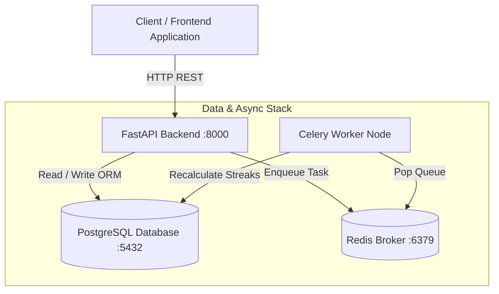

# 🛡️ Sentinel Habit Tracker & Analytics Engine (Project 02)


## 📌 Project Overview

The **Sentinel Habit Tracker & Analytics Engine** is a high-performance productivity dashboard backend designed to track daily habits, recalculate continuity streaks asynchronously, and maintain dynamic user metadata. Built with **FastAPI**, **SQLAlchemy**, **Celery**, and **Redis**, Sentinel combines relational consistency with dynamic schema flexibility.



---

## 💡 Hybrid Schema Design Rationale

Standard relational databases enforce rigid columns, making it difficult to support user-customized habit tracking features (such as dynamic measurement units, custom color themes, reminder intervals, and custom tag hierarchies).

Sentinel addresses this by utilizing a **Hybrid Schema Model**:
- **Structured Relational Fields**: Core attributes (`id`, `user_id`, `title`, `current_streak`, `longest_streak`, `total_completions`) are modeled as relational SQL columns for indexing, relational integrity, and fast SQL analytical queries.
- **Flexible JSONB Column**: A `metadata_json` field stores dynamic, user-defined properties without requiring schema migrations:
  ```json
  {
    "target_unit": "pages",
    "daily_goal": 25,
    "theme_color": "#4F46E5",
    "reminder_time": "08:00 AM",
    "tags": ["reading", "intellectual", "morning_routine"]
  }
  ```

---

## ⚡ Asynchronous Pipeline Design

Streak recalculation after habit completion logs can involve processing historical logs across large time ranges. 

1. **Non-Blocking API Response**: When a user logs a habit completion via `POST /api/v1/habits/{id}/logs`, FastAPI immediately records the log entry and dispatches a background job (`recalculate_habit_streak.delay(habit_id)`).
2. **Worker Processing**: The **Celery Worker** pulls the job from **Redis** and calculates streak continuity asynchronously without blocking HTTP response times.

---

## 📁 Directory Layout

```text
02-sentinel-habit-tracker/
├── 📄 docker-compose.yml       # Orchestrates FastAPI, PostgreSQL, Redis, and Celery worker
├── 📄 Dockerfile               # Multi-stage Python 3.11 build
├── 📄 requirements.txt         # Core dependencies (FastAPI, SQLAlchemy, Celery, Redis)
├── 📄 README.md                # Comprehensive documentation
└── 📁 src/
    ├── 📄 database.py          # SQLAlchemy engine connection & session management
    ├── 📄 models.py            # User, Habit (JSONB hybrid), and HabitLog ORM entities
    ├── 📄 celery_app.py        # Celery application setup with Redis broker
    ├── 📄 tasks.py             # Asynchronous Celery streak calculation jobs
    └── 📄 main.py              # FastAPI REST endpoints & Pydantic validation schemas
```

---

## 🚀 Execution & Quick Start Guide

### Step 1: Launch via Docker Compose

```bash
cd 02-sentinel-habit-tracker
docker-compose up -d --build
```

### Step 2: Verify Service Health

- **FastAPI API**: [http://localhost:8001/health](http://localhost:8001/health)
- **Interactive Swagger Docs**: [http://localhost:8001/docs](http://localhost:8001/docs)

### Step 3: Example API Operations

1. **Create User**:
   ```bash
   curl -X POST "http://localhost:8001/api/v1/users" \
     -H "Content-Type: application/json" \
     -d '{"email": "alex@example.com", "full_name": "Alex Mercer"}'
   ```

2. **Create Habit with Dynamic JSONB Metadata**:
   ```bash
   curl -X POST "http://localhost:8001/api/v1/habits" \
     -H "Content-Type: application/json" \
     -d '{
       "user_id": 1,
       "title": "Deep Work Reading",
       "category": "Productivity",
       "frequency": "daily",
       "metadata_json": {
         "target_pages": 30,
         "color_theme": "#10B981"
       }
     }'
   ```

3. **Log Habit Completion (Triggers Async Streak Calculation)**:
   ```bash
   curl -X POST "http://localhost:8001/api/v1/habits/1/logs" \
     -H "Content-Type: application/json" \
     -d '{"status": "completed", "notes": "Read Chapter 4 on Distributed Systems"}'
   ```

4. **Retrieve Streak Analytics**:
   ```bash
   curl "http://localhost:8001/api/v1/analytics/streaks?user_id=1"
   ```
