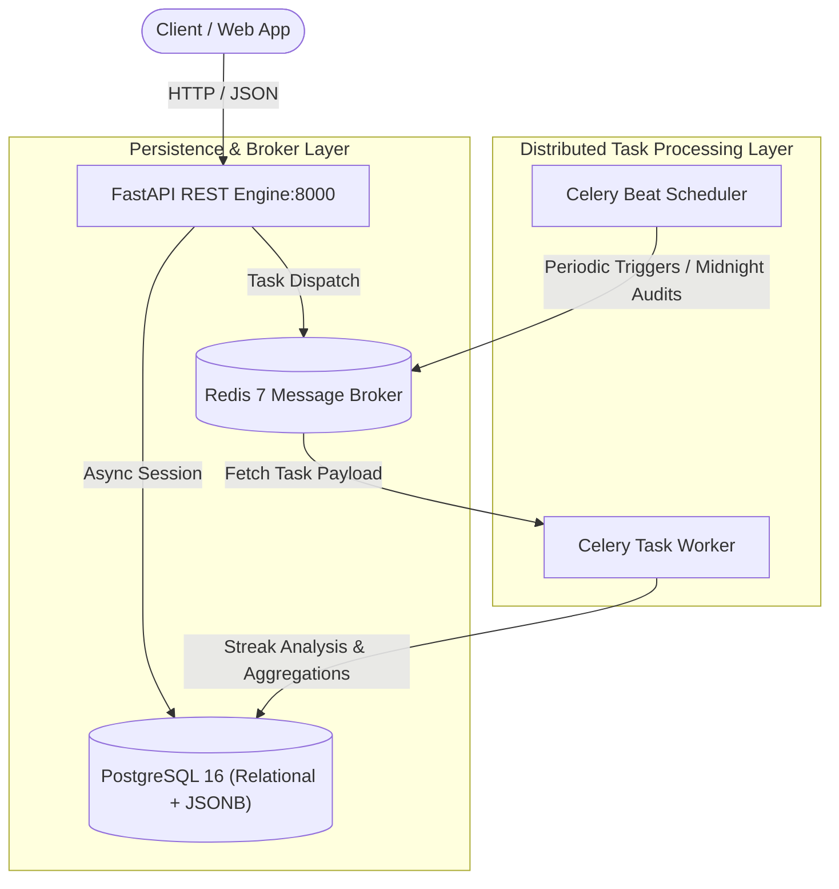

# 🛡️ Sentinel Habit Tracker (Project 02)


---

## 📌 Architecture Overview

The **Sentinel Habit Tracker** is an autonomous, event-driven habit monitoring and analytics engine. It leverages **Celery distributed workers** and **Redis** to offload computationally intensive streak calculations and historical habit analytics asynchronously, ensuring non-blocking, high-performance RESTful API endpoints via **FastAPI** and **SQLAlchemy 2.0**.



---

## 🛠️ Technology Stack & Core Components

| Component | Technology | Purpose | Implementation Detail |
| --- | --- | --- | --- |
| **REST API Layer** | Python 3.11 / FastAPI | High-throughput asynchronous endpoints | Async route handlers & Pydantic validation |
| **Task Queue & Broker** | Celery / Redis 7 | Distributed background worker orchestration | Asynchronous streak calculations & analytics |
| **Persistence Layer** | PostgreSQL 16 / JSONB | Relational user schemas with semi-structured logs | Hybrid relational + document storage |
| **ORM & Migrations** | SQLAlchemy 2.0 / Alembic | Strict type-hinted database abstraction | AsyncSession with connection pooling |
| **Task Scheduler** | Celery Beat | Automated cron-like streak reset & audit jobs | Nightly automated verification runs |

---

## 🔄 Asynchronous Pipeline & Hybrid Storage

1. **Non-Blocking Ingestion**: When users log habit events via the API, FastAPI writes the event record and dispatches an asynchronous task to Redis in `<5ms`.
2. **Distributed Streak Calculation**: Celery workers ingest log streams, compute running daily/weekly streaks, and update time-series aggregations without blocking concurrent API traffic.
3. **Hybrid JSONB Strategy**: Relational tables handle structured user metadata and foreign key relationships, while PostgreSQL `JSONB` fields store flexible, habit-specific dynamic telemetry (e.g., custom metrics, completion variables).

---

## 📁 Directory Layout

```text
02-sentinel-habit-tracker/
├── 📄 docker-compose.yml           # Multi-service setup (FastAPI + Worker + Postgres + Redis)
├── 📄 README.md                    # Project documentation & architecture specs
├── 📄 requirements.txt             # Pinned dependencies (FastAPI, Celery, SQLAlchemy)
├── 📁 alembic/                     # Database migration revisions
│   ├── 📄 env.py
│   └── 📁 versions/
├── 📁 scripts/                     # Operational automation scripts
│   └── 📄 seed_db.py               # Test data generation script
└── 📁 src/
    ├── 📄 celery_app.py            # Celery worker configuration and task routing
    ├── 📄 config.py                # Environment validation via Pydantic Settings
    ├── 📄 database.py              # Async SQLAlchemy engine & session factory
    ├── 📁 api/                     # REST API routers (habits, analytics, users)
    │   ├── 📄 habits.py
    │   └── 📄 analytics.py
    ├── 📁 models/                  # SQLAlchemy ORM models (relational + JSONB)
    │   └── 📄 habit.py
    ├── 📁 schemas/                 # Pydantic schemas for request/response serialization
    │   └── 📄 habit.py
    └── 📁 tasks/                   # Background Celery tasks
        └── 📄 streak_calculator.py # Asynchronous streak analysis logic

```

---

## 🚀 Local Development & Execution

### Prerequisites

* [Docker Engine](https://docs.docker.com/engine/install/) & [Docker Compose](https://docs.docker.com/compose/)
* Python 3.11+

### Running the System with Docker Compose

1. Navigate to the project directory:
```bash
cd 02-sentinel-habit-tracker

```


2. Initialize environment configurations:
```bash
cp .env.example .env

```


3. Build and run all services (API, Celery Worker, Redis, and PostgreSQL):
```bash
docker-compose up -d --build

```


4. Check running services and logs:
```bash
docker-compose ps
docker-compose logs -f celery_worker

```


5. Access interactive API documentation:
* **Swagger UI**: `http://localhost:8000/docs`
* **Redoc**: `http://localhost:8000/redoc`


---

## 🔐 Key Implementation Highlights

* **SQLAlchemy 2.0 Async Pipeline**: Full async/await database access utilizing `asyncpg` drivers for minimal latency under load.
* **Idempotent Background Jobs**: Streak calculation jobs are designed to be idempotent to prevent duplicate counts during network retries.
* **Automated Validation**: Pydantic models enforce strict payload sanitization before reaching database transaction boundaries.
