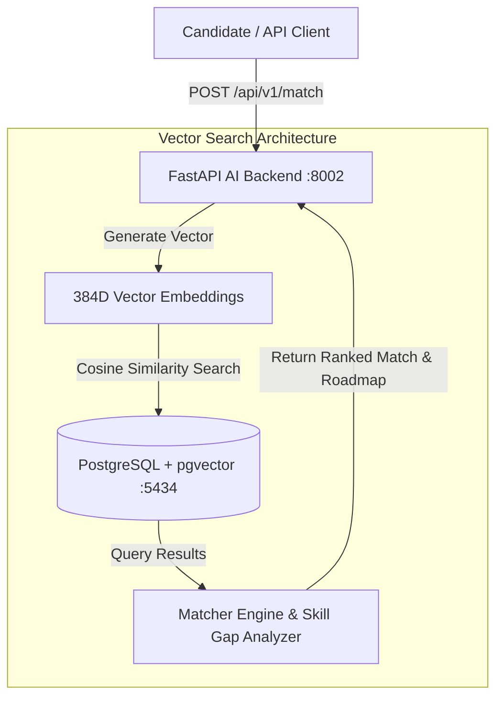

# 🤖 AI Career Path & Skill Navigation System (Project 03)


## 📌 Project Overview

The **AI Career Path & Skill Navigation System** is a vector-search powered career guidance platform. It maps candidate skill profiles against industry role benchmarks using **384-dimensional dense vector embeddings** and **pgvector** similarity search, isolating missing skill gaps and generating personalized career learning roadmaps.



---

## 🧮 Vector Search Methodology & Math

Traditional keyword search fails to capture semantic relationships between skill sets (e.g. knowing `"PyTorch"` and `"TensorFlow"` implies deep learning proficiency).

### 1. Vector Representation (`Vector(384)`)
Candidate skill profiles and job benchmarks are mapped into a **384-dimensional dense vector space** compatible with Transformer sentence embedding models (e.g., `all-MiniLM-L6-v2`):
\[
v \in \mathbb{R}^{384}, \quad \|v\|_2 = 1
\]

### 2. Cosine Similarity Metric
The similarity between candidate embedding vector \(A\) and job benchmark vector \(B\) is calculated as:
\[
\text{Cosine Similarity}(A, B) = \frac{A \cdot B}{\|A\|_2 \|B\|_2} = \sum_{i=1}^{384} A_i B_i
\]

### 3. PostgreSQL `pgvector` Cosine Operator (`<=>`)
`pgvector` computes vector distance directly inside PostgreSQL using the cosine distance operator:
```sql
SELECT id, role_title, 1 - (embedding <=> :candidate_vec) AS similarity_score
FROM job_benchmarks
ORDER BY embedding <=> :candidate_vec ASC
LIMIT 3;
```

---

## 📁 Directory Layout

```text
03-ai-career-path-system/
├── 📄 docker-compose.yml       # PostgreSQL with pgvector + FastAPI container
├── 📄 Dockerfile               # Multi-stage Python 3.11 build
├── 📄 requirements.txt         # Core dependencies (FastAPI, pgvector, NumPy)
├── 📄 README.md                # Comprehensive project documentation
└── 📁 src/
    ├── 📄 database.py          # SQLAlchemy session & vector extension initializer
    ├── 📄 models.py            # JobBenchmark & StudentProfile ORM entities with Vector(384)
    ├── 📄 matcher.py           # Cosine similarity math & skill gap algorithm
    └── 📄 main.py              # FastAPI endpoints for matching & roadmaps
```

---

## 🚀 Execution & Quick Start Guide

### Step 1: Launch Container Stack

```bash
cd 03-ai-career-path-system
docker-compose up -d --build
```

### Step 2: Verify Service & Vector Extension

- **Health Endpoint**: [http://localhost:8002/health](http://localhost:8002/health)
- **Interactive Swagger Docs**: [http://localhost:8002/docs](http://localhost:8002/docs)

---

### Step 3: Example API Operations

1. **Create Job Role Benchmark**:
   ```bash
   curl -X POST "http://localhost:8002/api/v1/jobs" \
     -H "Content-Type: application/json" \
     -d '{
       "role_title": "AI Infrastructure Engineer",
       "category": "AI / Engineering",
       "experience_level": "Mid",
       "required_skills": ["Python", "Docker", "Kubernetes", "PostgreSQL", "PyTorch", "FastAPI"],
       "description": "Designs high-scale AI vector search pipelines and cloud microservices."
     }'
   ```

2. **Create Candidate Student Profile**:
   ```bash
   curl -X POST "http://localhost:8002/api/v1/students" \
     -H "Content-Type: application/json" \
     -d '{
       "full_name": "Elena Rostova",
       "email": "elena@example.com",
       "target_role": "AI Infrastructure Engineer",
       "current_skills": ["Python", "Docker", "FastAPI"]
     }'
   ```

3. **Perform Vector Similarity Match**:
   ```bash
   curl -X POST "http://localhost:8002/api/v1/match" \
     -H "Content-Type: application/json" \
     -d '{"student_id": 1, "top_k": 3}'
   ```

4. **Generate Skill Gap Roadmap**:
   ```bash
   curl "http://localhost:8002/api/v1/roadmap/1"
   ```
