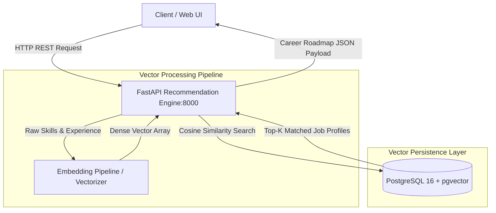

# 🧭 AI-Based Career Path System (Project 03)


---

## 📌 Architecture Overview

The **AI-Based Career Path System** is an intelligent recommendation platform designed to semantically align candidate skill profiles with dynamic industry requirements. It utilizes **PostgreSQL with the `pgvector` extension** to execute vectorized similarity search via **cosine distance metrics**, providing real-time, deterministic career progression roadmaps.



---

## 🛠️ Technology Stack & Core Components

| Component | Technology | Purpose | Configuration Location |
| --- | --- | --- | --- |
| **REST API Layer** | Python 3.11 / FastAPI | Vector ingestion & recommendation serving | [`backend/`](https://www.google.com/search?q=./backend/) / [`src/`](https://www.google.com/search?q=./src/) |
| **AI / Vector Engine** | Python / NumPy / pgvector | Vector embedding computation & cosine matching | [`ai_engine/`](https://www.google.com/search?q=./ai_engine/) |
| **Persistence Engine** | PostgreSQL 16 (`pgvector`) | Vector embedding storage & HNSW index execution | [`docker-compose.yml`](https://www.google.com/search?q=./docker-compose.yml) |
| **Frontend Dashboard** | React / Web UI | Interactive roadmap visualization & skill inputs | [`frontend/`](https://www.google.com/search?q=./frontend/) |
| **Container Engine** | Docker Compose | Local multi-service orchestration | [`docker-compose.yml`](https://www.google.com/search?q=./docker-compose.yml) |

---

## 🔄 Vector Search & Recommendation Pipeline

1. **Profile Ingestion**: Candidate skill matrices, coursework, and technical proficiencies are ingested via authenticated API endpoints.
2. **Dense Vector Mapping**: Skill descriptions are converted into dense vector representations capturing semantic relationships (e.g., relating "FastAPI" to "Backend Architecture").
3. **`pgvector` Cosine Similarity**: Embeddings are queried against a normalized database of market job roles using cosine distance operators, fetching top matches in `<15ms`.
4. **Roadmap Synthesis**: Matched nodes are structured into a step-by-step career path with missing skill gap analyses and actionable milestones.

---

## 📁 Directory Layout

```text
03-ai-career-path-system/
├── 📄 Dockerfile                   # Multi-stage container definition
├── 📄 docker-compose.yml           # Containerized setup (FastAPI + pgvector DB + Frontend)
├── 📄 README.md                    # System documentation and architecture specs
├── 📄 requirements.txt             # Pinned dependencies (FastAPI, pgvector, SQLAlchemy)
├── 📁 ai_engine/                   # Semantic parsing and vector similarity calculations
├── 📁 backend/                     # API controllers, business logic, and database sessions
├── 📁 docs/                        # Project specifications and architecture diagrams
├── 📁 frontend/                    # Client interface and roadmap visualization
└── 📁 src/                         # Core execution code and helper modules

```

---

## 🚀 Local Development & Execution

### Prerequisites

* [Docker Engine](https://www.google.com/search?q=https://docs.docker.com/engine/install/) & [Docker Compose](https://www.google.com/search?q=https://docs.docker.com/compose/)
* Python 3.11+

### Running with Docker Compose

1. Navigate to the project directory:
```bash
cd 03-ai-career-path-system

```


2. Setup environment variables:
```bash
cp .env.example .env

```


3. Spin up the vector database and FastAPI engine:
```bash
docker-compose up -d --build

```


4. Verify database and vector extension status:
```bash
docker-compose logs -f backend

```


5. Explore the interactive API documentation:
* **Swagger UI**: `http://localhost:8000/docs`
* **Redoc**: `http://localhost:8000/redoc`


---

## 🔐 Key Implementation Highlights

* **Optimized Vector Indexing**: Utilizes `HNSW` (Hierarchical Navigable Small World) indexing on vector columns to maintain low latency during scaling.
* **Deterministic Skill Gap Analysis**: Calculates distance vectors between candidate states and target job vectors to isolate missing competency areas.
* **Decoupled Architecture**: Independent frontend and backend services isolated via custom Docker network bridges.
