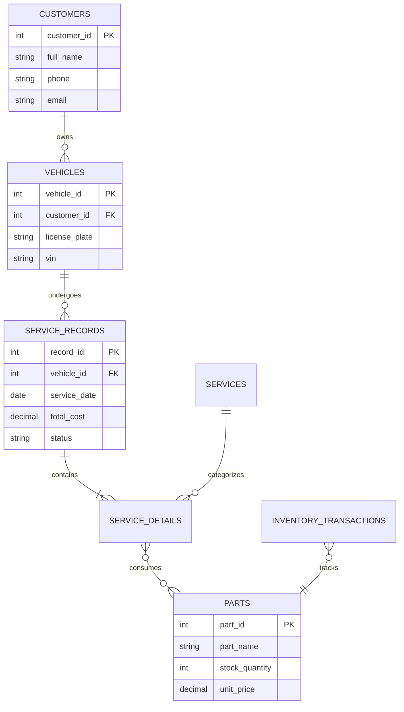

# 🔧 Garage Database Management System (Project 04)


---

## 📌 Architecture Overview

The **Garage Database System** is a high-integrity, strictly 3NF-normalized relational database built in **PostgreSQL**. Designed for automotive service and parts management operations, it features atomic **PL/pgSQL stored procedures**, automated inventory reduction triggers, foreign key constraints with safe cascades, and **B-tree indexing** for low-latency queries under high transactional volume.



---

## 🛠️ Technology Stack & Database Specifications

| Layer | Technology / Concept | Implementation Purpose |
| --- | --- | --- |
| **Engine** | PostgreSQL 16 | ACID-compliant relational data management |
| **Schema Standard** | 3NF Normalization | Elimination of transitive dependencies & data redundancy |
| **Automation** | PL/pgSQL Triggers | Automated stock reduction upon completed service events |
| **Stored Procedures** | PL/pgSQL | Atomic multi-table checkout and invoice generation |
| **Performance Tuning** | B-Tree Indexes & `EXPLAIN ANALYZE` | Sub-millisecond record lookups across VIN/license plates |

---

## 🔄 Core Database Mechanisms

1. **Transactional Integrity**: Multi-table write workflows (invoicing, labor logging, inventory usage) are wrapped in atomic transactions (`BEGIN ... COMMIT`) to guarantee ACID compliance.
2. **Automated Inventory Reduction**: A PL/pgSQL trigger intercepts status transitions on `service_records` (e.g., `status = 'COMPLETED'`) and automatically deducts allocated parts quantities from the `parts` inventory table.
3. **Data Integrity Constraints**: Strict `CHECK` constraints prevent negative stock balances and invalid price inputs; foreign key constraints enforce referential integrity with strict deletion rules.
4. **Index Optimization**: Composite B-tree indexes applied on `(vehicle_id, service_date)` and unique indexes on `vin` and `license_plate` to optimize frequent query paths.

---

## 📁 Directory Layout

```text
04-garage-database-system/
├── 📄 README.md                    # Database design & optimization documentation
├── 📄 docker-compose.yml           # PostgreSQL instance initialization setup
├── 📁 sql/                         # Database scripts
│   ├── 📄 01_schema_ddl.sql        # 3NF table creation, PK/FK constraints, and check rules
│   ├── 📄 02_triggers_procedures.sql # PL/pgSQL functions, triggers, and stored procedures
│   ├── 📄 03_indexes_views.sql     # Indexing strategies and reporting views
│   └── 📄 04_seed_data.sql         # Benchmark test dataset
└── 📁 queries/                     # Performance and analytical query benchmarks
    ├── 📄 inventory_audit.sql
    └── 📄 service_history_lookup.sql

```

---

## 🚀 Setup & Execution

### Prerequisites

* [Docker Engine](https://docs.docker.com/engine/install/) or local PostgreSQL 16 installation
* `psql` command-line utility

### Running with Docker

1. Navigate to the project directory:
```bash
cd 04-garage-database-system

```


2. Start the PostgreSQL instance and apply scripts:
```bash
docker-compose up -d

```


3. Connect to the database using `psql`:
```bash
docker exec -it garage_postgres psql -U postgres -d garage_db

```


4. Execute a benchmark test query with execution plan analysis:
```sql
EXPLAIN ANALYZE 
SELECT * FROM service_records 
WHERE service_date >= '2026-01-01' 
ORDER BY service_date DESC;

```


---

## 🔐 Key Implementation Highlights

* **Zero-Redundancy Relational Architecture**: Designed from scratch using strict functional dependency analysis to achieve 3NF compliance.
* **Idempotent Automation**: Triggers ensure part inventory accurately reflects real-time consumption without manual sync steps.
* **Auditing & History**: Dedicated transaction logs record historical price changes and inventory adjustments for complete data traceability.
