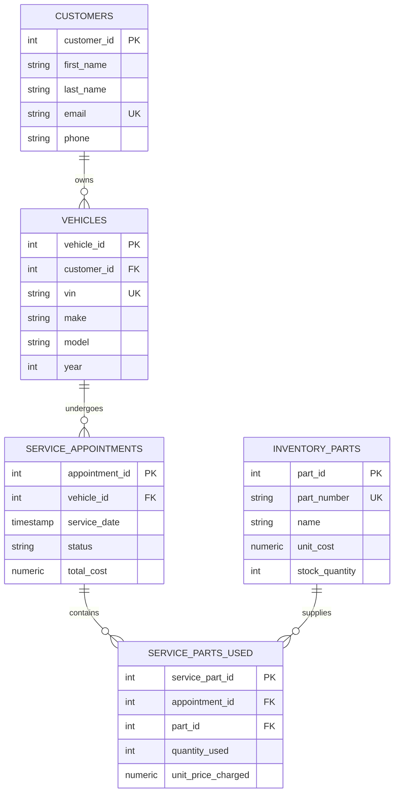

# 🚘 Garage & Automotive Repair Management System (Project 04)


## 📌 Database Architecture Overview

The **Garage & Automotive Repair Management System** is a database-centric platform designed for vehicle repair workshops. Adhering to **3rd Normal Form (3NF)** relational principles, it models customers, vehicle records, spare parts inventory, repair appointments, and itemized billing.



---

## 📐 3rd Normal Form (3NF) Normalization Rationale

The database structure strictly enforces **3NF** to eliminate data redundancy and insertion/update anomalies:
1. **1NF (First Normal Form)**: All column values are atomic (e.g. single VIN strings, separated customer names, discrete part line items).
2. **2NF (Second Normal Form)**: All non-key attributes depend on the complete Primary Key. Junction table `service_parts_used` separates individual line items from general appointment headers.
3. **3NF (Third Normal Form)**: Transitive dependencies are removed. Customer contact details reside exclusively in `customers`, vehicle specs reside in `vehicles`, and part costs reside in `inventory_parts`.

---

## ⚡ Automated PL/pgSQL Triggers & Inventory Safeguards

- **`deduct_inventory_on_part_used()` Trigger**: Automatically fires `BEFORE INSERT` on `service_parts_used`.
  - Verifies that `inventory_parts.stock_quantity >= NEW.quantity_used`.
  - If stock is insufficient, it aborts the transaction with `RAISE EXCEPTION`.
  - Otherwise, it automatically decrements stock levels atomically.

- **`recalculate_appointment_total()` Procedure**: Re-evaluates labor costs plus the sum of parts used (`quantity_used * unit_price_charged`) to ensure billing accuracy.

---

## 📁 Directory Layout

```text
04-garage-database-system/
├── 📄 docker-compose.yml           # PostgreSQL 16 container with script auto-init
├── 📄 README.md                    # Data dictionary & architecture documentation
└── 📁 sql/
    ├── 📄 01_schema_3nf.sql        # 3NF table schemas (Customers, Vehicles, Parts, Services)
    ├── 📄 02_procedures_triggers.sql # PL/pgSQL inventory triggers & calculation procedures
    └── 📄 03_indexes_optimization.sql # B-tree indexes and analytical views
```

---

## 🚀 Execution & Quick Start Guide

### Step 1: Launch PostgreSQL with Auto-Initialization

```bash
cd 04-garage-database-system
docker-compose up -d
```

### Step 2: Connect via `psql` CLI

```bash
docker exec -it garage_postgres psql -U garage_admin -d garage_db
```

---

### Step 3: Test Trigger & Query Views

1. **Insert Sample Data**:
   ```sql
   INSERT INTO customers (first_name, last_name, email, phone) 
   VALUES ('Marcus', 'Vance', 'marcus@example.com', '555-0199');

   INSERT INTO vehicles (customer_id, vin, make, model, year, license_plate) 
   VALUES (1, '1HGCR2F83HA000001', 'Honda', 'Accord', 2017, '7ABC123');

   INSERT INTO inventory_parts (part_number, name, unit_cost, unit_price, stock_quantity) 
   VALUES ('FILT-001', 'Synthetic Oil Filter', 5.00, 12.50, 20);

   INSERT INTO service_appointments (vehicle_id, labor_cost) 
   VALUES (1, 45.00);
   ```

2. **Test Automated Inventory Deduction Trigger**:
   ```sql
   -- Logging part usage automatically decrements stock from 20 to 18
   INSERT INTO service_parts_used (appointment_id, part_id, quantity_used, unit_price_charged)
   VALUES (1, 1, 2, 12.50);

   -- Check stock level
   SELECT name, stock_quantity FROM inventory_parts WHERE part_id = 1;
   ```

3. **Query Analytical Views**:
   ```sql
   SELECT * FROM v_low_stock_alerts;
   SELECT * FROM v_vehicle_service_history;
   ```
