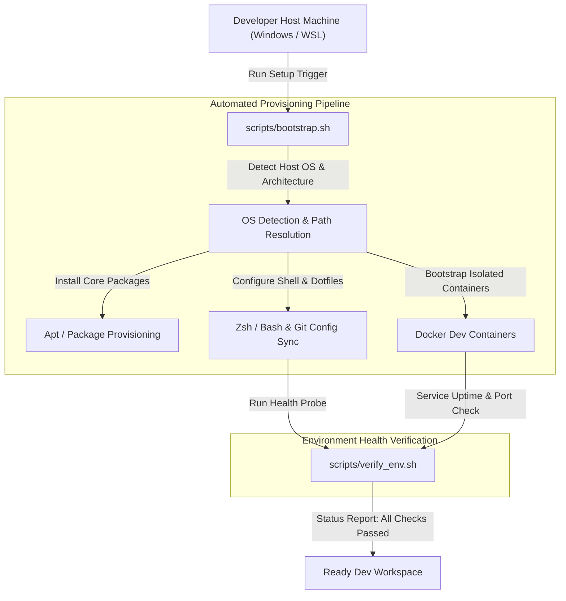

# ⚙️ System Environment Staging & Parity Automation (Project 05)


---

## 📌 Architecture Overview

The **System Environment Staging** project provides automated provisioning scripts and environment parity configurations for cross-platform software engineering. It standardizes runtime dependencies, shell configurations, database instances, and diagnostic checks across **Ubuntu WSL** and **Windows**, eliminating cross-platform configuration drift and environment-specific bugs.



---

## 🛠️ Technology Stack & Core Tooling

| Component | Tool / Technology | Purpose | Implementation Detail |
| --- | --- | --- | --- |
| **Shell Automation** | Bash 5.0+ | Idempotent environment setup & package installation | [`scripts/bootstrap.sh`](https://www.google.com/search?q=./scripts/bootstrap.sh) |
| **Verification Engine** | Shell / Python | Automated sanity checks for runtimes and tools | [`scripts/verify_env.sh`](https://www.google.com/search?q=./scripts/verify_env.sh) |
| **Container Runtimes** | Docker / Compose | Isolated staging services (Postgres, Redis, Node) | [`docker-compose.yml`](https://www.google.com/search?q=./docker-compose.yml) |
| **Config Synchronization** | Dotfiles / Symlinks | Uniform shell aliases, prompt configs, and Git paths | [`configs/`](https://www.google.com/search?q=./configs/) |
| **OS Target Layer** | Ubuntu (WSL2) / Windows | Cross-platform development parity | Subsystem bridge configurations |

---

## 🔄 Automated Staging & Parity Workflows

1. **Idempotent Bootstrapping**: `bootstrap.sh` inspects existing tool chains (`python3`, `node`, `docker`, `psql`) and installs missing dependencies without overwriting existing configs.
2. **Path & Line-Ending Normalization**: Enforces strict `LF` line-endings and path translations across Windows host drives (`/mnt/c/`) and WSL root filesystems.
3. **Automated Diagnostic Health Probes**: `verify_env.sh` runs automated assertions to verify installed CLI tool versions, database connectivity, and port availability.
4. **Isolated Runtime Staging**: Configures local background services in lightweight Docker networks to keep the host operating system clean.

---

## 📁 Directory Layout

```text
05-system-environment-staging/
├── 📄 README.md                    # Environment specifications and usage guide
├── 📄 docker-compose.yml           # Base development service staging (DBs, Caches)
├── 📁 configs/                     # Standardized configuration templates
│   ├── 📄 .bashrc_custom           # Cross-platform aliases and path definitions
│   └── 📄 gitconfig.template       # Standard Git credentials and format configs
├── 📁 docs/                        # Architecture guides and setup troubleshooting
└── 📁 scripts/                     # Executable automation scripts
    ├── 📄 bootstrap.sh             # Main idempotent system setup script
    ├── 📄 setup_wsl_bridge.sh      # WSL2 network and drive mounting automation
    └── 📄 verify_env.sh            # Diagnostic environment verification script

```

---

## 🚀 Execution & Verification

### Running the Setup Automation

1. Navigate to the project directory:
```bash
cd 05-system-environment-staging

```


2. Make scripts executable:
```bash
chmod +x scripts/*.sh

```


3. Execute the environment bootstrap script:
```bash
./scripts/bootstrap.sh

```


4. Run the health verification probe:
```bash
./scripts/verify_env.sh

```


---

## 🔐 Key Implementation Highlights

* **Zero-Drift Idempotency**: Scripts can be safely executed multiple times without corrupting existing configurations or duplicating package installs.
* **Deterministic Verification**: Fast exit codes on diagnostic checks prevent development on broken or unprovisioned environments.
* **Cross-Platform Compatibility**: Fully tested across native Ubuntu environments and Windows Subsystem for Linux (WSL2).

Let me know once committed, and we will proceed to **Project 06: `06-face-recognition-attendance`**.

```
