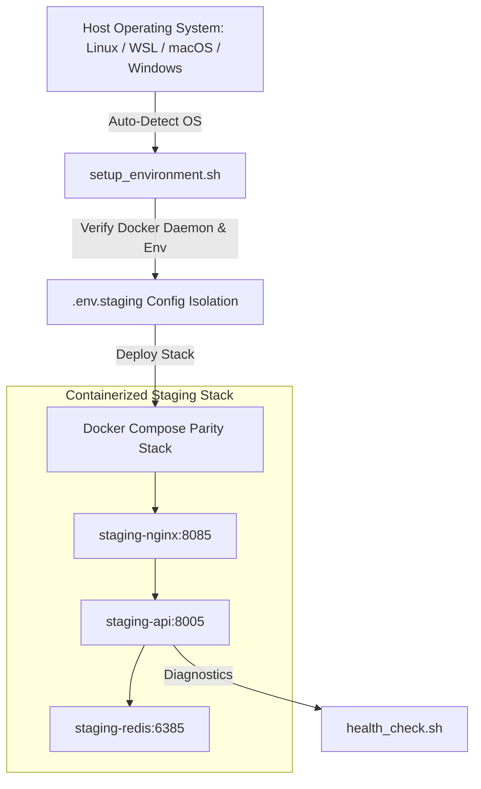

# ⚙️ Staging & Multi-Environment Deployment System (Project 05)


## 📌 Environment Architecture Overview

The **Staging & Multi-Environment Deployment System** enforces strict **12-Factor Environment Parity** across local development, staging preview, and production infrastructure. Using automated OS detection, Docker Compose profiles, and health checks, it guarantees zero environment-drift bugs when migrating code across host operating systems.



---

## 💻 Cross-OS Compatibility & Parity Matrix

| Host Environment | Supported Shell | OS Detection Signature | Execution Strategy |
| :--- | :--- | :--- | :--- |
| **Linux (Ubuntu/Debian)** | Native Bash | `Linux` | Direct Docker Engine socket mounting |
| **macOS (Darwin)** | Zsh / Bash | `Darwin` | Docker Desktop VM execution |
| **Windows Subsystem for Linux (WSL)** | WSL Bash | `Linux (microsoft)` | WSL2 Linux kernel Docker backend |
| **Windows Native (Git Bash)** | Git Bash / MSYS | `MINGW / MSYS` | Windows Docker Desktop Pipe socket |

---

## 🛠️ Automated Scripts & Tooling

1. **[`scripts/setup_environment.sh`](./scripts/setup_environment.sh)**:
   - Identifies the host operating system automatically.
   - Inspects Docker daemon responsiveness.
   - Generates `.env.staging` defaults if configuration is missing.
   - Builds and boots the staging container stack.

2. **[`scripts/health_check.sh`](./scripts/health_check.sh)**:
   - Validates running container health status.
   - Performs HTTP probes on API endpoints (`http://localhost:8005/health`).
   - Executes Redis `PING-PONG` connectivity check.

---

## 📁 Directory Layout

```text
05-system-environment-staging/
├── 📄 docker-compose.yml           # Multi-service staging stack (API, Redis, Nginx)
├── 📄 Dockerfile                   # Multi-stage Python 3.11 build
├── 📄 README.md                    # Comprehensive cross-OS staging documentation
└── 📁 scripts/
    ├── 📄 setup_environment.sh     # Cross-platform automated provisioning engine
    └── 📄 health_check.sh          # Environment diagnostic and health suite
```

---

## 🚀 Execution & Quick Start Guide

### Step 1: Run Provisioning Script

#### On Linux / WSL / macOS:
```bash
cd 05-system-environment-staging
chmod +x scripts/setup_environment.sh scripts/health_check.sh
./scripts/setup_environment.sh
```

#### On Windows (Git Bash):
```bash
bash scripts/setup_environment.sh
```

---

### Step 2: Run Diagnostic Health Checks

```bash
./scripts/health_check.sh
```

---

### Step 3: Direct API Probes

```bash
# API Health Probe
curl http://localhost:8005/health

# Proxy Gateway Probe
curl http://localhost:8085
```
