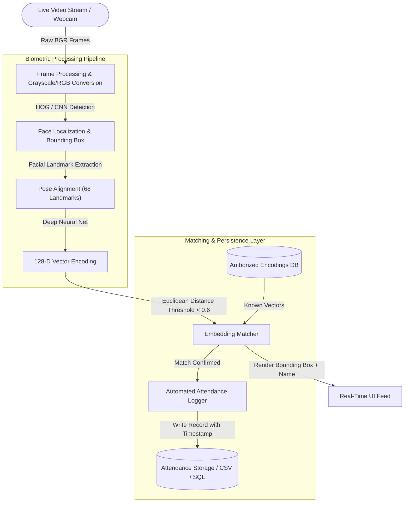

# 👁️ Real-Time Face Recognition Attendance System (Project 06)


---

## 📌 Architecture Overview

The **Face Recognition Attendance System** is an automated, contactless biometric logging engine. It uses **OpenCV** and deep learning facial embeddings to detect human faces in real time from video feeds, generate **128-dimensional feature vectors**, and match them against an authorized database to record attendance records securely.



---

## 🛠️ Technology Stack & Core Tooling

| Layer / Component | Technology | Purpose | Implementation Detail |
| --- | --- | --- | --- |
| **Vision Framework** | OpenCV (cv2) | Frame capture, color space conversion, and UI rendering | Real-time video processing pipeline |
| **Biometric Engine** | `face_recognition` / dlib | Deep metric learning for 128D facial feature vectors | ResNet-based facial landmark model |
| **Matching Algorithm** | Euclidean Vector Distance | Fast classification against known facial vectors | Threshold `< 0.6` for strict precision |
| **Logging & Storage** | Python / SQLite / CSV | Idempotent timestamped attendance records | Duplicate check to prevent multiple logs per session |
| **Core Runtime** | Python 3.11 | Orchestration and execution scripts | Optimized batch vector processing |

---

## 🔄 Biometric Processing Pipeline

1. **Frame Ingestion**: Video frames are captured and scaled down to reduce compute latency without sacrificing facial landmark fidelity.
2. **Detection & Alignment**: Faces are located using HOG (Histogram of Oriented Gradients) feature maps or CNN detectors, with 68 facial landmarks extracted for pose normalization.
3. **128-Dimensional Embedding**: Aligned crops are passed through a pre-trained ResNet deep neural network to produce a compact, invariant 128D vector.
4. **Vector Distance Thresholding**: The runtime computes the Euclidean distance between candidate vectors and known student vectors. Distances below the confidence threshold register a verified match.
5. **Anti-Duplication Logging**: An in-memory cooldown cache prevents duplicate log entries for the same individual within a configurable time window.

---

## 📁 Directory Layout

```text
06-face-recognition-attendance/
├── 📄 README.md                    # Project documentation & biometric pipeline specs
├── 📄 requirements.txt             # Pinned dependencies (opencv-python, face-recognition)
├── 📁 data/
│   ├── 📁 known_faces/             # Authorized student reference images
│   └── 📁 attendance_logs/         # Generated attendance timestamp records
├── 📁 models/                      # Pre-computed encodings file (.pickle / .json)
│   └── 📄 encodings.pickle
└── 📁 src/
    ├── 📄 encode_faces.py          # Script to generate 128D encodings from reference photos
    ├── 📄 attendance_tracker.py    # Real-time webcam video stream processor & logger
    └── 📄 utils.py                 # Anti-bounce cooldown timer and CSV/DB write handlers

```

---

## 🚀 Setup & Execution

### Prerequisites

* Python 3.11+
* CMake (required for building `dlib`)
* Connected Webcam or RTSP Camera Stream

### Installation & Run Steps

1. Navigate to the project directory:
```bash
cd 06-face-recognition-attendance

```


2. Install dependencies:
```bash
pip install -r requirements.txt

```


3. Add reference photos into `data/known_faces/` (e.g., `sudeera.jpg`, `student_02.jpg`).
4. Generate face encodings database:
```bash
python src/encode_faces.py

```


5. Launch the live real-time attendance system:
```bash
python src/attendance_tracker.py

```


6. Press `q` on your keyboard to exit the live video feed.

---

## 🔐 Key Implementation Highlights

* **Real-Time Inference**: Processes live frames at 30+ FPS using frame skipping and resolution downsampling strategies.
* **Biometric Invariance**: Robust recognition across variable lighting conditions, head tilts, and minor facial alterations.
* **Duplicate Protection**: Configurable session cooldown prevents writing multiple entries for the same user during a single class session.
