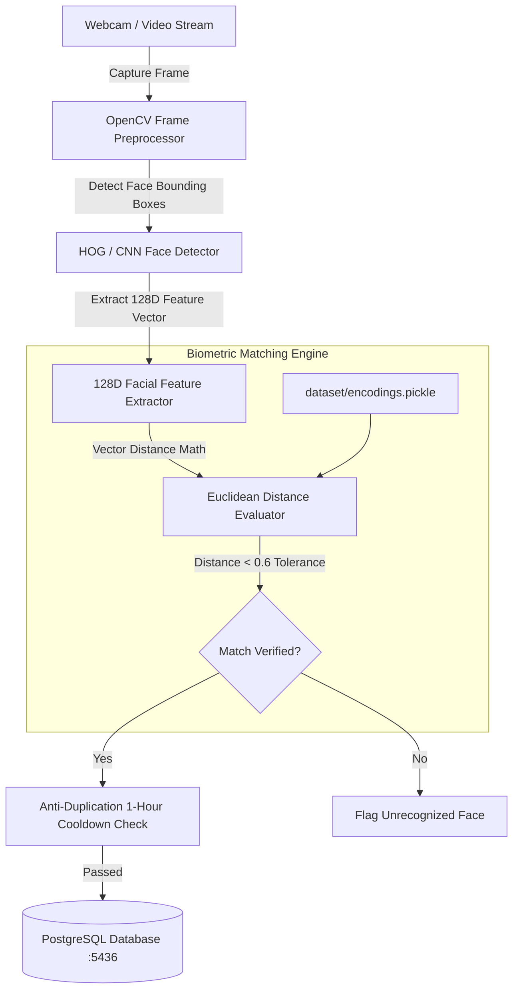

# 👁️ Face Recognition Smart Attendance System (Project 06)


## 📌 Computer Vision Pipeline Architecture

The **Face Recognition Smart Attendance System** is an automated biometric attendance logging platform. It captures camera video streams, locates facial bounding boxes using Histogram of Oriented Gradients (HOG) or Deep Convolutional Neural Networks (CNN), extracts **128-dimensional facial landmark encodings**, and measures Euclidean distances against registered employee embeddings to log timestamped attendance entries into PostgreSQL.



---

## 📐 Biometric Vector Representation & Distance Metrics

1. **Facial Feature Vector Extraction**: Each face is projected onto a 128-dimensional space representing facial landmark measurements (eye distance, nose width, jawline shape):
   \[
   E = [e_1, e_2, \dots, e_{128}], \quad \|E\|_2 = 1
   \]
2. **Euclidean Distance Formula**: The distance \(d\) between candidate vector \(E_{\text{cand}}\) and known reference vector \(E_{\text{ref}}\) is computed as:
   \[
   d(E_{\text{cand}}, E_{\text{ref}}) = \sqrt{\sum_{i=1}^{128} (e_{\text{cand}, i} - e_{\text{ref}, i})^2}
   \]
3. **Thresholding Criterion**: A match is confirmed if \(d(E_{\text{cand}}, E_{\text{ref}}) \le 0.6\). Confidence score is computed as:
   \[
   \text{Confidence} = \max\left(0.5, 1.0 - d\right)
   \]

---

## 📁 Directory Layout

```text
06-face-recognition-attendance/
├── 📄 docker-compose.yml       # PostgreSQL database + FastAPI management stack
├── 📄 Dockerfile               # Multi-stage build with OpenCV & dlib dependencies
├── 📄 requirements.txt         # Core dependencies (opencv-python-headless, face-recognition)
├── 📄 README.md                # Comprehensive computer vision documentation
└── 📁 src/
    ├── 📄 database.py          # SQLAlchemy engine connection & session management
    ├── 📄 models.py            # Employee & AttendanceLog ORM entities
    ├── 📄 encode_faces.py      # Dataset batch processing & 128D vector serializer
    ├── 📄 recognize_attendance.py # OpenCV video recognition & database logging
    └── 📄 main.py              # FastAPI REST endpoints for registration & logs
```

---

## 🚀 Execution & Quick Start Guide

### Step 1: Launch via Docker Compose

```bash
cd 06-face-recognition-attendance
docker-compose up -d --build
```

### Step 2: Verify API Health

- **Health Probe**: [http://localhost:8006/health](http://localhost:8006/health)
- **Interactive Swagger Docs**: [http://localhost:8006/docs](http://localhost:8006/docs)

---

### Step 3: Example API Operations

1. **Register Employee**:
   ```bash
   curl -X POST "http://localhost:8006/api/v1/employees" \
     -H "Content-Type: application/json" \
     -d '{
       "employee_code": "EMP001_Alex_Mercer",
       "full_name": "Alex Mercer",
       "department": "Computer Vision & AI"
     }'
   ```

2. **Trigger Biometric Dataset Encoding Job**:
   ```bash
   curl -X POST "http://localhost:8006/api/v1/encode"
   ```

3. **Simulate Biometric Verification & Attendance Log**:
   ```bash
   curl -X POST "http://localhost:8006/api/v1/verify" \
     -H "Content-Type: application/json" \
     -d '{"employee_code": "EMP001_Alex_Mercer"}'
   ```

4. **Query Attendance Logs**:
   ```bash
   curl "http://localhost:8006/api/v1/attendance?limit=10"
   ```
