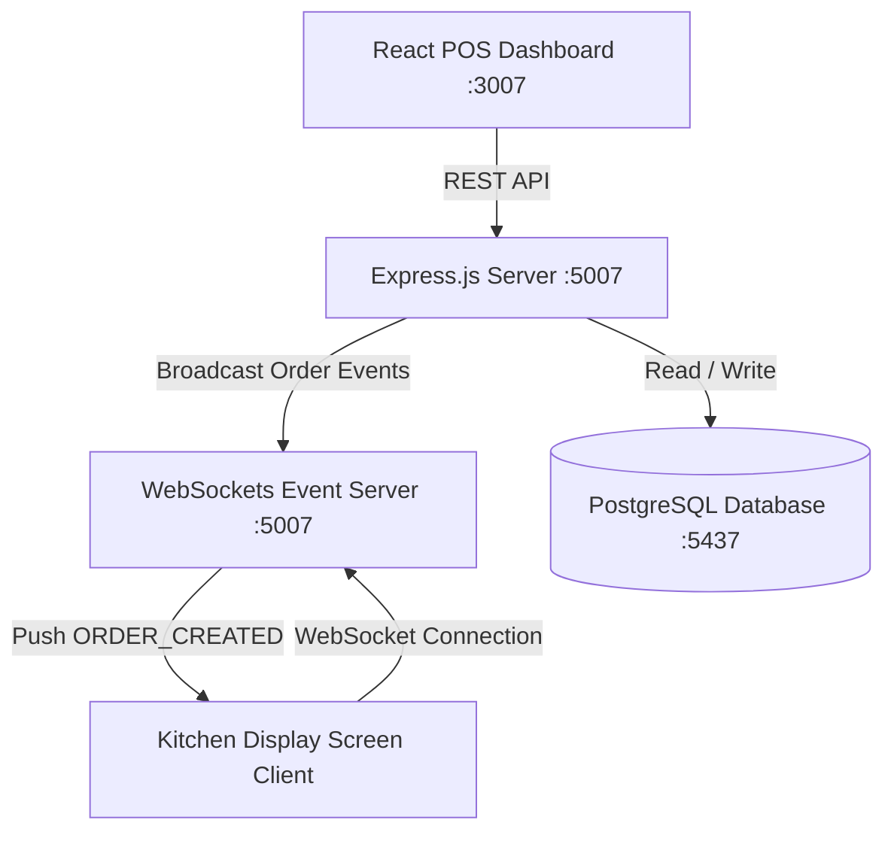

# ☕ Intelligent Cafe Management & POS System (Project 07)


## 📌 Architecture Overview

The **Intelligent Cafe Management & POS System** is a full-stack Point of Sale (POS) and Kitchen Operations manager. It decouples the **React POS Frontend**, **Express.js REST & WebSockets Backend**, and **PostgreSQL Database** to synchronize floor table availability, order taking, item billing, and Kitchen Display System (KDS) feeds in real time.



---

## ⚡ Real-Time WebSocket Kitchen Synchronization

1. **Order Dispatch**: When a waiter or cashier submits an order via the POS interface (`POST /api/v1/orders`), the Express backend saves the transaction and immediately broadcasts an `ORDER_CREATED` event to all open WebSocket connections.
2. **KDS Event Listener**: Connected **Kitchen Display System (KDS)** screens instantly render the new order card without polling HTTP endpoints.
3. **Table Status Synchronization**: Updating table state (e.g. `available` -> `occupied`) automatically triggers a `TABLE_STATUS_UPDATED` WebSocket event to update the floor grid layout across all terminals.

---

## 📁 Directory Layout

```text
07-cafe-management-system/
├── 📄 docker-compose.yml           # PostgreSQL + Express API + React Frontend stack
├── 📄 README.md                    # Comprehensive POS documentation
├── 📁 backend/
│   ├── 📄 Dockerfile               # Node.js 18-alpine backend image
│   ├── 📄 package.json             # Express, pg, cors, and ws dependencies
│   └── 📁 src/
│       └── 📄 server.js            # REST API routes & WebSockets event broadcaster
└── 📁 frontend/
    ├── 📄 Dockerfile               # React build + Nginx static asset server
    ├── 📄 package.json             # React 18, Vite dependencies
    ├── 📄 index.html               # Vite HTML entry point
    └── 📁 src/
        └── 📄 App.jsx              # Interactive Floor Grid, Menu & KDS POS Component
```

---

## 🚀 Execution & Quick Start Guide

### Step 1: Launch Stack via Docker Compose

```bash
cd 07-cafe-management-system
docker-compose up -d --build
```

### Step 2: Access Applications

- **React POS Dashboard**: [http://localhost:3007](http://localhost:3007)
- **Express Backend API Health**: [http://localhost:5007/health](http://localhost:5007/health)

---

### Step 3: Example REST Operations

1. **Get Table Floor Grid**:
   ```bash
   curl http://localhost:5007/api/v1/tables
   ```

2. **Get Menu Catalog**:
   ```bash
   curl http://localhost:5007/api/v1/menu
   ```

3. **Submit POS Order**:
   ```bash
   curl -X POST "http://localhost:5007/api/v1/orders" \
     -H "Content-Type: application/json" \
     -d '{
       "tableId": 1,
       "items": [
         {"id": 102, "name": "Oat Milk Latte", "price": 5.25, "quantity": 1},
         {"id": 104, "name": "Artisanal Croissant", "price": 4.00, "quantity": 2}
       ]
     }'
   ```
