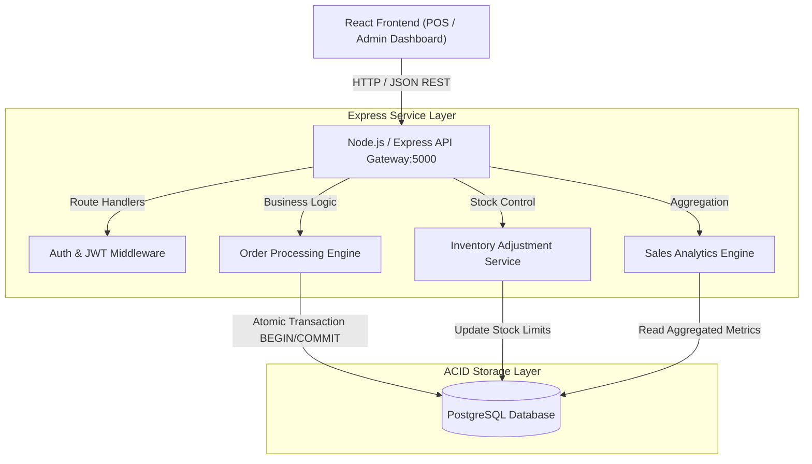

# ☕ Cafe Management POS & Inventory System (Project 07)


-336791)


---

## 📌 Architecture Overview

The **Cafe Management POS System** is an end-to-end full-stack point-of-sale and inventory platform. It features a decoupled architecture with a responsive **React** frontend for cashier workflows and administrative reporting, communicating via a **Node.js/Express REST API** with an **ACID-compliant PostgreSQL** database to handle real-time inventory adjustments and transaction logging.



---

## 🛠️ Technology Stack & Core Components

| Component | Technology | Purpose | Implementation Detail |
| --- | --- | --- | --- |
| **Frontend Client** | React / Vite / CSS3 | Interactive cashier POS & management portal | Component state, modular UI, Axios HTTP |
| **Backend Service** | Node.js / Express.js | Core API endpoints & transactional business logic | Express routers, async middleware, error filters |
| **Persistence Engine** | PostgreSQL 16 | ACID-compliant transaction & menu storage | Foreign key constraints & indexed lookup queries |
| **Authentication** | JSON Web Tokens (JWT) | Role-based access control (Admin vs. Cashier) | Bearer token authentication headers |
| **Containerization** | Docker Compose | Local unified service orchestrator | Multi-container setup for API and Database |

---

## 🔄 Transactional Workflows & Stock Control

1. **Order Processing**: Cashiers submit customer orders with customized modifiers. The API initializes an atomic PostgreSQL transaction.
2. **Real-Time Inventory Reduction**: For each item in the order, corresponding ingredient/stock levels are decremented in the inventory table. If stock is insufficient, the transaction rolls back gracefully with an error payload.
3. **Receipt & Audit Generation**: Completed transactions write a permanent sales log and generate an itemized invoice payload.
4. **Analytics Aggregation**: The reporting module calculates daily gross sales, popular menu items, and peak service hours using SQL aggregate functions (`SUM`, `COUNT`, `GROUP BY`).

---

## 📁 Directory Layout

```text
07-cafe-management-system/
├── 📄 docker-compose.yml           # Unified local container orchestration
├── 📄 README.md                    # System architecture & setup documentation
├── 📁 client/                      # React frontend application
│   ├── 📄 package.json
│   ├── 📁 public/
│   └── 📁 src/
│       ├── 📁 components/          # Reusable UI widgets (Cart, MenuItem, Modal)
│       ├── 📁 pages/               # POS Screen, Inventory Dashboard, Analytics
│       └── 📁 services/            # Axios API client integrations
└── 📁 server/                      # Node.js / Express backend application
    ├── 📄 package.json
    ├── 📄 server.js                # Express entry point and server bootstrap
    ├── 📁 config/                  # Database connection pool (pg-pool)
    ├── 📁 controllers/             # Request handlers (orders, products, reports)
    ├── 📁 middleware/              # JWT verification and role authorization
    ├── 📁 routes/                  # API route definitions (/api/orders, /api/inventory)
    └── 📁 database/                # Schema DDL and seed datasets
        └── 📄 schema.sql

```

---

## 🚀 Setup & Execution

### Prerequisites

* [Docker Engine](https://docs.docker.com/engine/install/) & [Docker Compose](https://docs.docker.com/compose/) (or Node.js 18+ and PostgreSQL)

### Running with Docker Compose

1. Navigate to the project directory:
```bash
cd 07-cafe-management-system

```


2. Start the database and backend services:
```bash
docker-compose up -d --build

```


3. Access the services:
* **Frontend Application**: `http://localhost:3000`
* **Backend REST API**: `http://localhost:5000/api`
* **Health Endpoint**: `http://localhost:5000/api/health`


---

## 🔐 Key Implementation Highlights

* **ACID Guarantees**: Order checkout runs inside PostgreSQL transaction blocks to eliminate race conditions during concurrent stock updates.
* **Role-Based Authorization**: Distinct privilege layers ensure cashiers only access order creation, while administrative routes (inventory editing, sales reports) require admin tokens.
* **Decoupled Architecture**: Clean separation between React client state and backend business logic ensures easy extensibility and maintenance.
