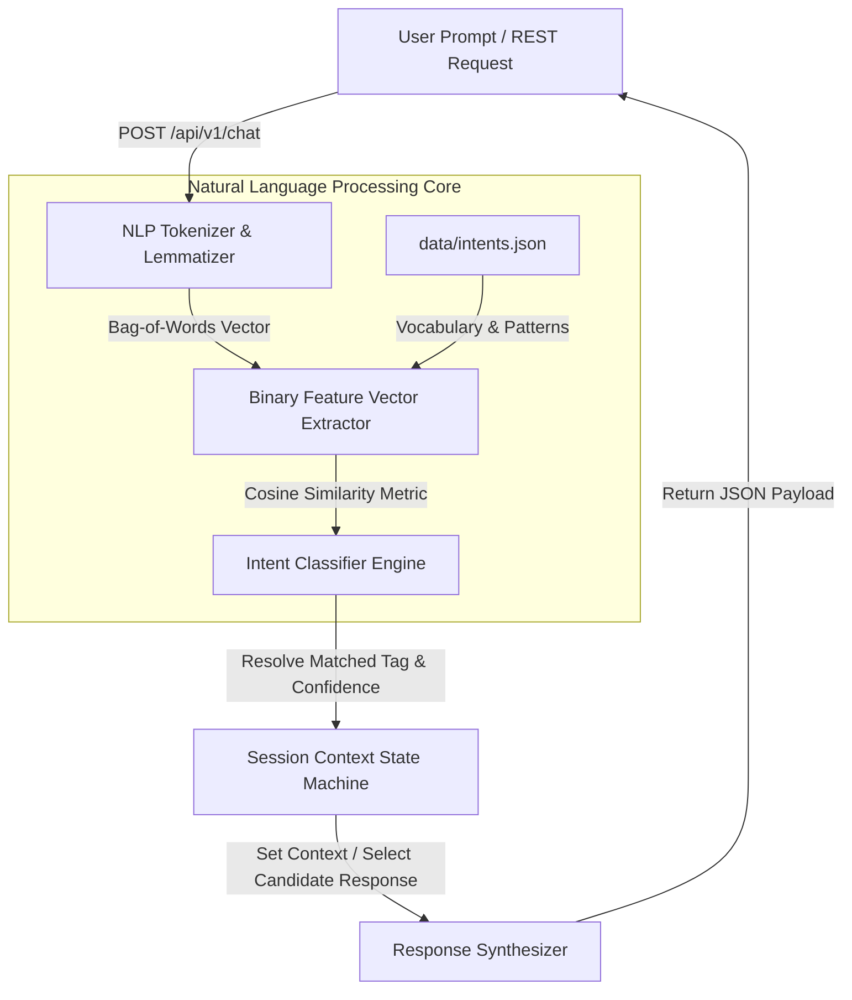

# 🤖 Intelligent Context-Aware Python Chatbot (Project 08)


## 📌 NLP Pipeline Architecture

The **Intelligent Context-Aware Python Chatbot** is an enterprise conversational AI microservice. It processes natural language user prompts via NLTK tokenization, lemmatization, Bag-of-Words feature vector encoding, and intent similarity classification against a structured JSON knowledge base, maintaining session context state across multi-turn interactions.



---

## 📐 Mathematical Formulation & Preprocessing

### 1. Tokenization & Lemmatization
Input text \(S\) is normalized and tokenized into lower-case alphanumeric tokens \(T\). Each token \(t \in T\) is reduced to its base lemma form \(l(t)\):
\[
L(S) = \{ l(t) \mid t \in \text{Tokenize}(S) \}
\]

### 2. Bag-of-Words (BoW) Vectorization
Given a global vocabulary \(V = [v_1, v_2, \dots, v_M]\) of size \(M\), the binary feature vector \(X \in \{0, 1\}^M\) is generated:
\[
X_i = \begin{cases} 1 & \text{if } v_i \in L(S) \\ 0 & \text{otherwise} \end{cases}
\]

### 3. Intent Similarity Metric
Cosine similarity is calculated between user prompt vector \(X_{\text{user}}\) and intent pattern vector \(X_{\text{pattern}}\):
\[
\text{Similarity}(X_{\text{user}}, X_{\text{pattern}}) = \frac{X_{\text{user}} \cdot X_{\text{pattern}}}{\|X_{\text{user}}\|_2 \|X_{\text{pattern}}\|_2}
\]

---

## 📁 Directory Layout

```text
08-intelligent-python-chatbot/
├── 📄 docker-compose.yml       # Chatbot API container stack
├── 📄 Dockerfile               # Python 3.11 build with pre-downloaded NLTK data
├── 📄 requirements.txt         # Core dependencies (nltk, fastapi, uvicorn, numpy)
├── 📄 README.md                # Comprehensive NLP pipeline documentation
├── 📁 data/
│   └── 📄 intents.json         # Structured intent tags, patterns, and responses
└── 📁 src/
    ├── 📄 chatbot.py           # Tokenizer, lemmatizer, Bag-of-Words, and context state
    └── 📄 main.py              # FastAPI REST endpoints & JSON schema handlers
```

---

## 🚀 Execution & Quick Start Guide

### Step 1: Launch Container Stack

```bash
cd 08-intelligent-python-chatbot
docker-compose up -d --build
```

### Step 2: Verify Service Health

- **Health Probe**: [http://localhost:8008/health](http://localhost:8008/health)
- **Interactive Swagger Docs**: [http://localhost:8008/docs](http://localhost:8008/docs)

---

### Step 3: Example API Operations

1. **Ask Business Hours**:
   ```bash
   curl -X POST "http://localhost:8008/api/v1/chat" \
     -H "Content-Type: application/json" \
     -d '{"message": "What time are you open?", "session_id": "user_101"}'
   ```

2. **Inquire About Capabilities & Services**:
   ```bash
   curl -X POST "http://localhost:8008/api/v1/chat" \
     -H "Content-Type: application/json" \
     -d '{"message": "What services do you offer?", "session_id": "user_101"}'
   ```

3. **Inquire Pricing (Sets Session Context State)**:
   ```bash
   curl -X POST "http://localhost:8008/api/v1/chat" \
     -H "Content-Type: application/json" \
     -d '{"message": "How much does it cost?", "session_id": "user_101"}'
   ```

4. **Retrieve Active Intents Knowledge Base**:
   ```bash
   curl "http://localhost:8008/api/v1/intents"
   ```
