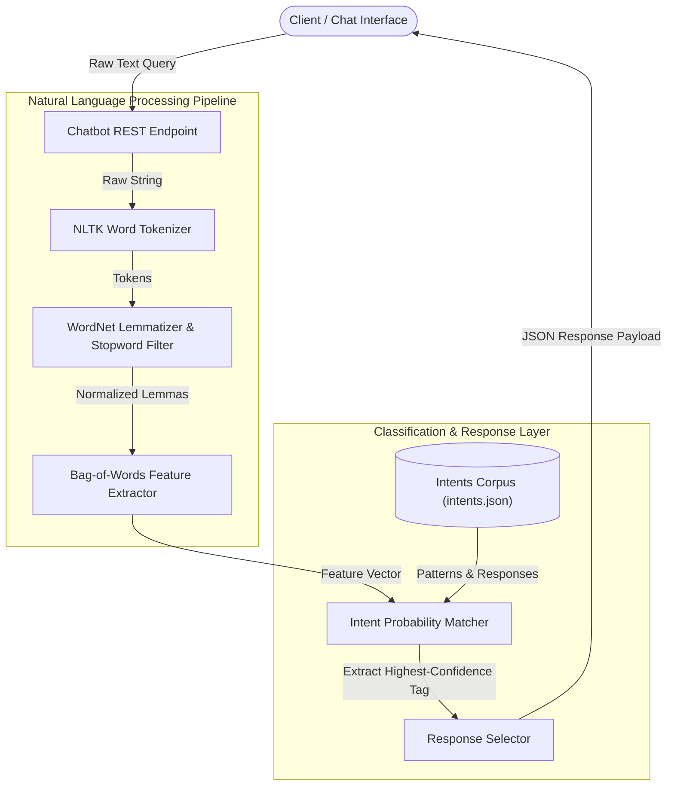

# 💬 Intelligent Python Chatbot (Project 08)

-green)


---

## 📌 Architecture Overview

The **Intelligent Python Chatbot** is a conversational NLP engine designed for automated intent detection and context-aware query resolution. Built with **NLTK** and Python, it normalizes unstructured user text through a deterministic preprocessing pipeline (tokenization, lowercasing, punctuation stripping, and lemmatization) and matches the resulting feature vectors against structured intent corpora to return high-confidence responses via a lightweight API.



---

## 🛠️ Technology Stack & Core Components

| Component | Technology | Purpose | Implementation Detail |
| --- | --- | --- | --- |
| **NLP Engine** | NLTK (Natural Language Toolkit) | Text tokenization, stem/lemmatization, vocabulary creation | `nltk.tokenize`, `nltk.stem.WordNetLemmatizer` |
| **Feature Extraction** | NumPy / Bag of Words | Numerical representation of text queries | Binary & frequency vector arrays |
| **Corpus & Patterns** | JSON Intent Schema | Structured intent catalog, tags, and responses | [`data/intents.json`](https://www.google.com/search?q=./data/intents.json) |
| **API Interface** | FastAPI / Flask | Lightweight endpoint exposing chatbot inference | RESTful `/api/chat` POST route |
| **Core Runtime** | Python 3.11 | Preprocessing and classification pipeline | Deterministic fallback handlers |

---

## 🔄 NLP Ingestion & Intent Classification Pipeline

1. **Text Normalization**: Ingested messages are broken down into individual token arrays and normalized using `WordNetLemmatizer` to reduce words to their base dictionary lemmas (e.g., "running" $\rightarrow$ "run").
2. **Feature Vector Generation**: The system builds a binary Bag-of-Words matrix by comparing normalized user input tokens against a pre-trained vocabulary index.
3. **Intent Probability Scoring**: The classifier scores similarity against tagged training patterns in `intents.json` to assign an intent classification probability.
4. **Context-Aware Response Selection**: If the confidence threshold exceeds the designated minimum (e.g., $>0.75$), an appropriate response template is returned. Queries below threshold route to a fallback handler.

---

## 📁 Directory Layout

```text
08-intelligent-python-chatbot/
├── 📄 README.md                    # Project documentation & NLP architecture
├── 📄 requirements.txt             # Pinned dependencies (nltk, numpy, fastapi)
├── 📁 data/
│   └── 📄 intents.json             # Structured conversation intent schemas & templates
├── 📁 models/                      # Pickled vocabulary, word lists, and intent classes
│   ├── 📄 words.pkl
│   └── 📄 classes.pkl
└── 📁 src/
    ├── 📄 train.py                 # Pipeline training and vocabulary generation script
    ├── 📄 chatbot_engine.py        # Tokenization, Lemmatization, and prediction logic
    └── 📄 app.py                   # REST API server for chat interactions

```

---

## 🚀 Setup & Execution

### Prerequisites

* Python 3.11+
* Virtual environment tool (`venv` or `conda`)

### Local Setup & Training

1. Navigate to the project directory:
```bash
cd 08-intelligent-python-chatbot

```


2. Install dependencies:
```bash
pip install -r requirements.txt

```


3. Train the model and compile the vocabulary assets:
```bash
python src/train.py

```


4. Launch the chat service API:
```bash
python src/app.py

```


5. Test the endpoint:
```bash
curl -X POST http://localhost:8000/api/chat \
  -H "Content-Type: application/json" \
  -d '{"message": "How do I check my order status?"}'

```


---

## 🔐 Key Implementation Highlights

* **Deterministic Text Processing**: Robust against capitalization variations, typo inflections, and punctuation anomalies.
* **Low Latency Inference**: In-memory vector matching ensures sub-5ms classification response times without heavy GPU overhead.
* **Extensible Schema**: Easy expansion for new intents and conversational branches via simple JSON definitions.
