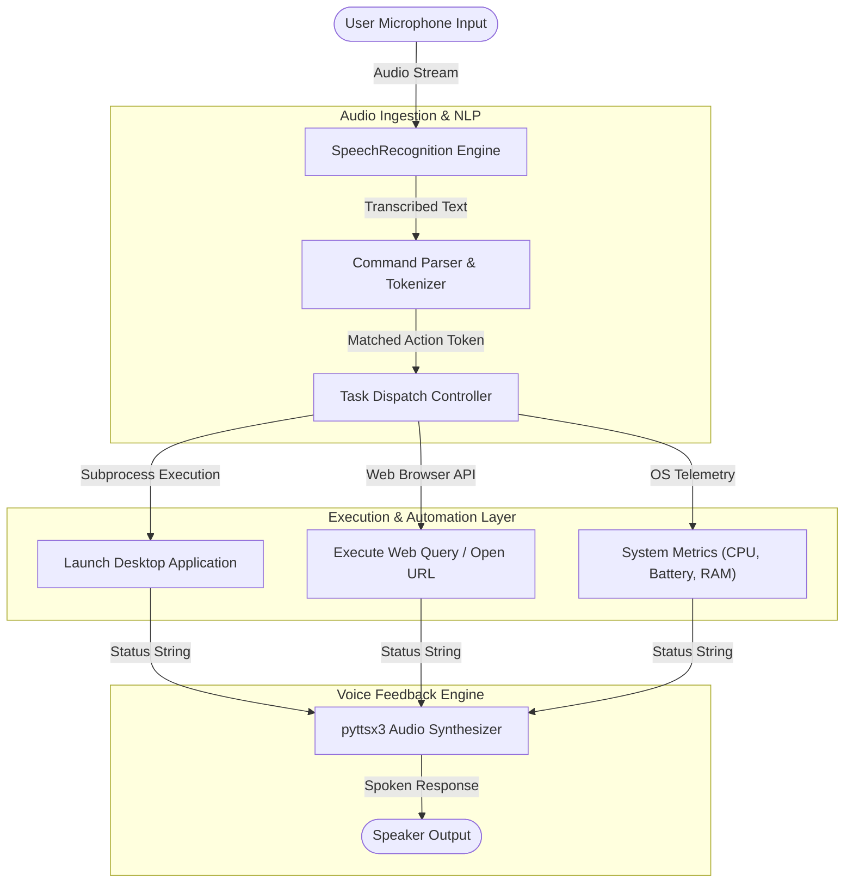

# 🎙️ Jarvis Voice Assistant & Desktop Automation (Project 09)


-9cf)

---

## 📌 Architecture Overview

The **Jarvis Voice Assistant** is a hands-free desktop automation tool designed for real-time speech processing and system task execution. It captures spoken audio input via microphone streams, converts speech to text, matches command intents, executes operating system commands (process launching, file management, web lookups), and delivers synthesized voice feedback using an **offline text-to-speech (TTS)** engine.



---

## 🛠️ Technology Stack & Core Components

| Component | Technology | Purpose | Implementation Detail |
| --- | --- | --- | --- |
| **Speech Recognition** | `SpeechRecognition` / PyAudio | Microphone stream capture and speech-to-text | Ambient noise calibration & phrase recognition |
| **Speech Synthesis** | `pyttsx3` | Offline text-to-speech audio feedback | Native SAPI5 / NSSpeechSynthesizer driver integration |
| **System Automation** | Python `os` / `subprocess` | Desktop process orchestration & command execution | Background process spawning & task management |
| **Information Extraction** | `wikipedia` / `webbrowser` | Automated web queries and summary retrieval | Web search automation and data scraping |
| **Core Runtime** | Python 3.11 | Event loop handling audio listening threads | Continuous listening with keyword activation |

---

## 🔄 Voice Processing & Task Execution Pipeline

1. **Ambient Noise Calibration**: On startup, the audio engine samples background noise thresholds to eliminate false triggers from low-volume static.
2. **Speech Ingestion & Transcription**: The microphone stream records spoken phrases, transcribing raw audio waveforms into clean text strings.
3. **Intent Parsing**: The command router identifies trigger verbs (e.g., `"open"`, `"search"`, `"system status"`, `"play"`) and isolates the target payload.
4. **Operating System Action**: The dispatcher triggers isolated subprocesses to execute requested actions without hanging the main listening thread.
5. **Auditory Confirmation**: The `pyttsx3` engine synthesizes a spoken confirmation response before re-entering the ambient listening loop.

---

## 📁 Directory Layout

```text
09-jarvis-voice-assistant/
├── 📄 README.md                    # System documentation & automation specifications
├── 📄 requirements.txt             # Pinned dependencies (SpeechRecognition, pyttsx3, PyAudio)
└── 📁 src/
    ├── 📄 main.py                  # Main event loop & voice listening lifecycle
    ├── 📄 voice_engine.py          # Speech-to-Text and Text-to-Speech audio drivers
    ├── 📄 command_handler.py       # Intent router and task dispatcher
    └── 📁 actions/                 # Modular system action plugins
        ├── 📄 app_launcher.py      # Desktop application and process handlers
        ├── 📄 system_info.py       # CPU, memory, and battery status probes
        └── 📄 web_actions.py       # Search automation and browser integrations

```

---

## 🚀 Setup & Execution

### Prerequisites

* Python 3.11+
* Working Microphone and Audio Output Devices
* `PortAudio` (required for `PyAudio`)

### Installation & Run Steps

1. Navigate to the project directory:
```bash
cd 09-jarvis-voice-assistant

```


2. Install system audio dependencies (Ubuntu/Debian if applicable):
```bash
sudo apt-get install python3-pyaudio portaudio19-dev

```


3. Install Python dependencies:
```bash
pip install -r requirements.txt

```


4. Launch the voice assistant:
```bash
python src/main.py

```


5. Speak commands naturally (e.g., *"Jarvis, check system status"*, *"Jarvis, open code editor"*).

---

## 🔐 Key Implementation Highlights

* **Offline Voice Synthesis**: Operates without external cloud TTS API dependencies, ensuring zero network latency for synthesized voice output.
* **Non-Blocking Execution**: System operations run via asynchronous subprocesses to keep the voice listener responsive.
* **Modular Plugin Architecture**: New system automation commands can be added by implementing new functions inside `src/actions/`.
