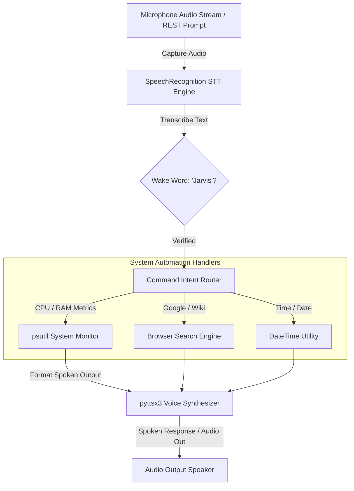

# 🎙️ Jarvis Voice-Activated Desktop Assistant (Project 09)


## 📌 Voice Architecture Overview

The **Jarvis Voice-Activated Desktop Assistant** is a hands-free voice automation platform. It captures microphone audio streams via **SpeechRecognition (STT)**, evaluates wake-word detection (`"Jarvis"`), routes intents to OS automation handlers (`psutil`, web search, time announcements), and returns voice feedback using the **pyttsx3 Text-to-Speech (TTS)** engine.



---

## 🔊 Audio Drivers & Cross-Platform TTS Engines

The voice assistant automatically binds to the appropriate host audio hardware drivers:
- **Windows**: Native `SAPI5` voice engine via `pyttsx3` and Windows Multimedia audio APIs.
- **macOS**: Native `NSSpeechSynthesizer` voice engine.
- **Linux / WSL**: `espeak` synthesizer and `ALSA` / `PulseAudio` sound drivers.
- **Headless / Docker Containers**: Falls back automatically to silent text mode and exposes the `/api/v1/voice/command` REST endpoint.

---

## 📁 Directory Layout

```text
09-jarvis-voice-assistant/
├── 📄 docker-compose.yml       # Microservice container stack
├── 📄 Dockerfile               # Python 3.11 build with espeak & portaudio drivers
├── 📄 requirements.txt         # Dependencies (SpeechRecognition, pyttsx3, PyAudio, psutil)
├── 📄 README.md                # Comprehensive voice architecture documentation
└── 📁 src/
    ├── 📄 commands.py          # OS metrics, web search, time, and intent router
    ├── 📄 assistant.py         # STT voice listener & pyttsx3 TTS synthesizer
    └── 📄 main.py              # FastAPI REST endpoints for headless command execution
```

---

## 🚀 Execution & Quick Start Guide

### Step 1: Launch via Docker Compose

```bash
cd 09-jarvis-voice-assistant
docker-compose up -d --build
```

### Step 2: Verify API Health

- **Health Probe**: [http://localhost:8009/health](http://localhost:8009/health)
- **Interactive Swagger Docs**: [http://localhost:8009/docs](http://localhost:8009/docs)

---

### Step 3: Example API Operations

1. **Query System Hardware Performance**:
   ```bash
   curl -X POST "http://localhost:8009/api/v1/voice/command" \
     -H "Content-Type: application/json" \
     -d '{"command": "Give me a system status report"}'
   ```

2. **Query Current Time and Date**:
   ```bash
   curl -X POST "http://localhost:8009/api/v1/voice/command" \
     -H "Content-Type: application/json" \
     -d '{"command": "What time is it?"}'
   ```

3. **Execute Web Search**:
   ```bash
   curl -X POST "http://localhost:8009/api/v1/voice/command" \
     -H "Content-Type: application/json" \
     -d '{"command": "Google search quantum computing"}'
   ```

4. **Direct System Metrics Endpoint**:
   ```bash
   curl http://localhost:8009/api/v1/system/status
   ```
