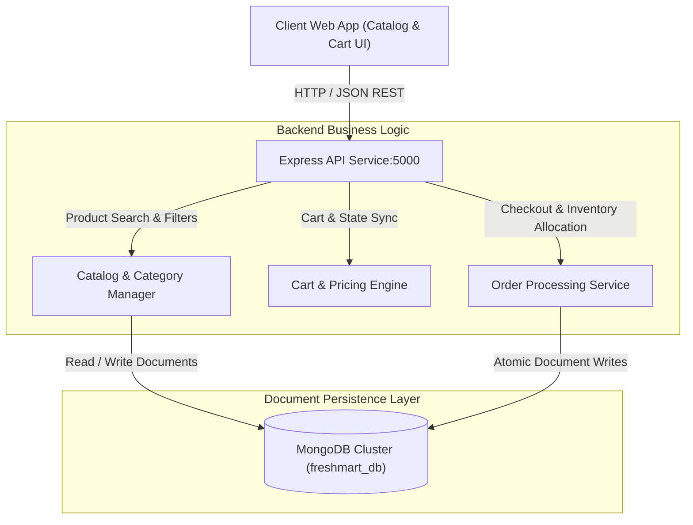

# 🛒 FreshMart E-Commerce & Grocery Management (Project 10)


-47A248)


---

## 📌 Architecture Overview

**FreshMart** is a full-stack e-commerce and grocery catalog engine. It leverages **MongoDB** document schemas to accommodate diverse product variations, categories, and dynamic stock levels. The system features a responsive frontend with client-side shopping cart state management, a decoupled **Node.js/Express REST API**, and a containerized deployment setup orchestrated via **Docker Compose**.



---

## 🛠️ Technology Stack & Core Components

| Component | Technology | Purpose | Implementation Detail |
| --- | --- | --- | --- |
| **Client UI** | JavaScript (ES6+) / HTML5 / CSS3 | Interactive product catalog & shopping cart | LocalStorage persistence & dynamic DOM updates |
| **REST API Layer** | Node.js / Express.js | Product filtering, cart calculation, order creation | Decoupled routing with JSON payload validation |
| **Document Database** | MongoDB 7 / Mongoose | Flexible product variations & nested order documents | Indexed search queries & schema validation |
| **Container Engine** | Docker Compose | Local multi-service orchestration | Unified network bridging API and database |
| **State Management** | Client State & REST Synchronization | Real-time cart calculation and price checks | Server-side total recalculation to prevent tampering |

---

## 🔄 Dynamic Document Model & Order Workflow

1. **Flexible Product Schemas**: MongoDB document storage supports varying grocery attributes (e.g., weights, perishable flags, dietary tags, units) without requiring schema migrations.
2. **Client-Side Cart Persistence**: Shopping cart items, counts, and active discounts persist across page reloads using browser local storage.
3. **Server-Side Price Validation**: During checkout, the backend recalculates unit prices and totals against the active database records to prevent client-side price manipulation.
4. **Atomic Order Logging**: Orders are persisted as nested JSON documents capturing a permanent snapshot of item prices, customer metadata, and transaction timestamps.

---

## 📁 Directory Layout

```text
10-freshmart-grocery-store/
├── 📄 docker-compose.yml           # Multi-container orchestration (App + MongoDB)
├── 📄 README.md                    # System architecture & setup documentation
├── 📄 package.json                 # Project dependencies and script configurations
├── 📁 public/                      # Static assets, styles, and client-side scripts
│   ├── 📁 css/
│   ├── 📁 js/                      # Cart state management and DOM renderers
│   └── 📄 index.html
├── 📁 src/                         # Server source code
│   ├── 📄 app.js                   # Express application setup and middleware
│   ├── 📄 server.js                # Server entry point and database connection
│   ├── 📁 config/                  # MongoDB URI and environment configurations
│   ├── 📁 controllers/             # Product, cart, and order business logic
│   ├── 📁 models/                  # Mongoose document schemas (Product, Order, User)
│   └── 📁 routes/                  # API endpoint definitions (/api/products, /api/orders)
└── 📁 data/                        # Seed datasets for product catalogs
    └── 📄 seed_products.json

```

---

## 🚀 Setup & Execution

### Prerequisites

* [Docker Engine](https://docs.docker.com/engine/install/) & [Docker Compose](https://docs.docker.com/compose/)
* Node.js 18+ and npm (for local non-containerized execution)

### Running with Docker Compose

1. Navigate to the project directory:
```bash
cd 10-freshmart-grocery-store

```


2. Spin up the application and MongoDB instance:
```bash
docker-compose up -d --build

```


3. Access the application:
* **Web Application & Storefront**: `http://localhost:5000`
* **API Endpoints**: `http://localhost:5000/api/products`


---

## 🔐 Key Implementation Highlights

* **Flexible Schema Architecture**: Mongoose schemas support dynamic product attributes and nested order line items without performance degradation.
* **Server-Side Price Integrity**: Independent price and discount verification prevents unauthorized checkout payload modifications.
* **Containerized Parity**: Single-command startup via `docker-compose up` provisions the database, applies seeds, and serves the application.
