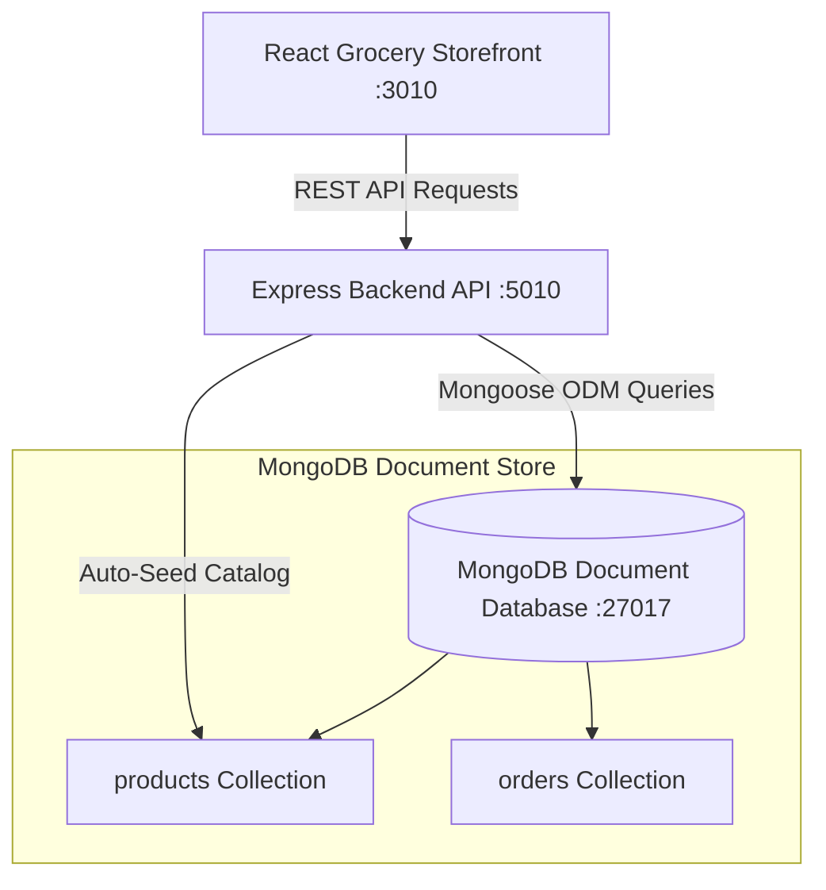

# 🛒 FreshMart E-Commerce & Grocery Delivery Platform (Project 10)


## 📌 Architecture Overview

The **FreshMart E-Commerce & Grocery Delivery Platform** is a full-stack document-oriented online supermarket platform. Built with **React**, **Express.js**, **Mongoose ODM**, and **MongoDB**, it provides product category navigation, real-time cart subtotal/tax calculation, checkout order placement, and inventory tracking.



---

## 🍃 Document-Oriented Data Model (MongoDB)

1. **`products` Collection**:
   ```json
   {
     "_id": "65cf10a2f...",
     "name": "Organic Honeycrisp Apples",
     "category": "Fresh Produce",
     "price": 2.99,
     "unit": "lb",
     "stock": 100,
     "isOrganic": true,
     "description": "Crisp and sweet organic apples sourced from local orchards."
   }
   ```

2. **`orders` Collection**:
   ```json
   {
     "_id": "65cf11b4f...",
     "customerName": "Alex Mercer",
     "email": "alex@example.com",
     "deliveryAddress": "742 Evergreen Terrace",
     "items": [
       { "productId": "65cf10a2f...", "name": "Organic Honeycrisp Apples", "price": 2.99, "quantity": 3 }
     ],
     "subtotal": 8.97,
     "deliveryFee": 3.99,
     "total": 12.96,
     "status": "Processing"
   }
   ```

---

## 📁 Directory Layout

```text
10-freshmart-grocery-store/
├── 📄 docker-compose.yml           # MongoDB + Express API + React Storefront stack
├── 📄 README.md                    # Comprehensive e-commerce documentation
├── 📁 backend/
│   ├── 📄 Dockerfile               # Node.js 18-alpine backend container
│   ├── 📄 package.json             # Express, mongoose, cors dependencies
│   └── 📁 src/
│       ├── 📄 server.js            # Express server & MongoDB initialization
│       └── 📁 models/
│           ├── 📄 Product.js       # Product catalog Mongoose schema
│           └── 📄 Order.js         # Order transaction Mongoose schema
└── 📁 frontend/
    ├── 📄 Dockerfile               # React build + Nginx static asset server
    ├── 📄 package.json             # React 18 & Vite dependencies
    ├── 📄 index.html               # Vite HTML entry point
    └── 📁 src/
        └── 📄 App.jsx              # Category Filter, Search Bar & Cart UI
```

---

## 🚀 Execution & Quick Start Guide

### Step 1: Launch Full Stack via Docker Compose

```bash
cd 10-freshmart-grocery-store
docker-compose up -d --build
```

### Step 2: Access Applications

- **React Grocery Storefront**: [http://localhost:3010](http://localhost:3010)
- **Express Backend API Health**: [http://localhost:5010/health](http://localhost:5010/health)

---

### Step 3: Example REST API Operations

1. **Query Product Catalog**:
   ```bash
   curl "http://localhost:5010/api/v1/products?category=Fresh%20Produce"
   ```

2. **Submit Grocery Checkout Order**:
   ```bash
   curl -X POST "http://localhost:5010/api/v1/orders" \
     -H "Content-Type: application/json" \
     -d '{
       "customerName": "Elena Rostova",
       "email": "elena@example.com",
       "deliveryAddress": "100 Innovation Way, Suite 400",
       "items": [
         { "productId": "p1", "name": "Organic Honeycrisp Apples", "price": 2.99, "quantity": 2 }
       ]
     }'
   ```

3. **Query Active Customer Orders**:
   ```bash
   curl http://localhost:5010/api/v1/orders
   ```
